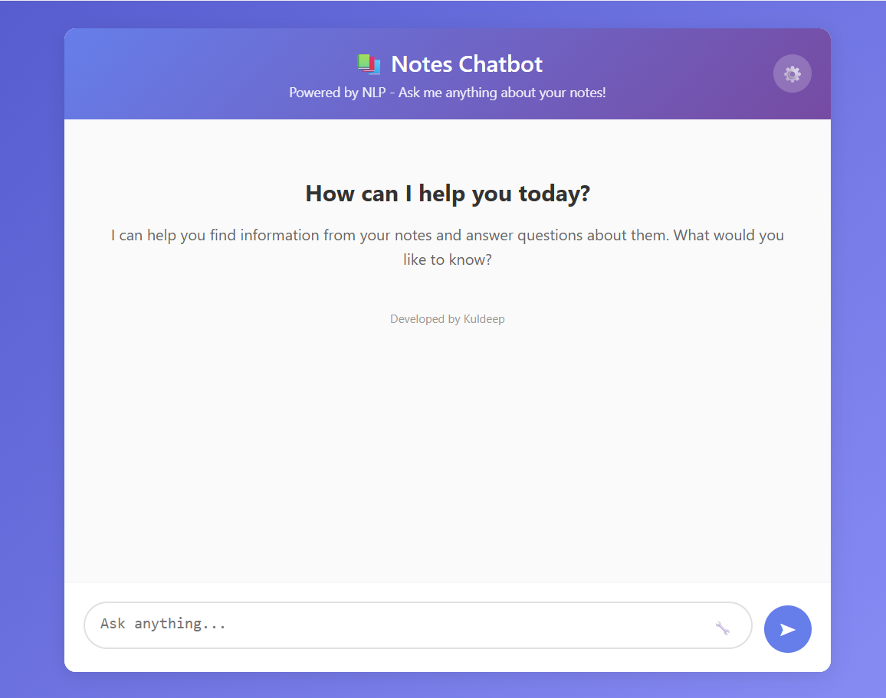

# 📚 TextIQ — Your Notes-Powered AI Chatbot

> A RAG-based chatbot that answers questions using your own notes, powered by Google Gemini.



---

## 🤖 What is TextIQ?

TextIQ is a smart chatbot that combines your personal notes with the power of AI to give accurate, context-aware answers. Instead of relying solely on the AI's memory, it first searches through *your* documents before generating a response — making answers more relevant and trustworthy.

---

## ✨ Features

- **RAG Architecture** — Retrieval-Augmented Generation ensures answers are grounded in your notes, not just AI guesswork.
- **Your Knowledge Base** — Feed it `.txt` files and it learns from *your* content.
- **Google Gemini Powered** — Natural, human-like responses using Gemini 1.5 Flash.
- **Markdown Support** — Responses are beautifully formatted with lists, tables, and code blocks.
- **Source Toggle** — Optionally view which parts of your notes were used to generate an answer.
- **Session Management** — Each user gets a unique session for a clean experience.

---

## 🧠 How It Works

1. You ask a question in the chat interface.
2. TextIQ searches your stored notes using a **FAISS vector store**.
3. The most relevant context is passed to **Google Gemini**.
4. Gemini generates a clear, accurate answer based on that context.

---

## 🛠️ Tech Stack

| Layer | Technology |
|---|---|
| Backend | Python, Flask |
| AI Model | Google Gemini 1.5 Flash |
| Embeddings | Google Generative AI Embeddings |
| Vector Store | FAISS (via LangChain) |
| Document Loading | LangChain DirectoryLoader |
| Frontend | HTML, CSS, JavaScript |

---

## 🚀 Getting Started

### 1. Clone the Repository
```bash
git clone https://github.com/yourusername/textiq.git
cd textiq
```

### 2. Install Dependencies
```bash
pip install flask langchain langchain-community langchain-google-genai faiss-cpu markdown
```

### 3. Add Your Notes
Place your `.txt` files inside the `notes/` folder. These become the chatbot's knowledge base.

### 4. Set Your API Key
Open `app.py` and replace the placeholder with your actual Google API key:
```python
os.environ["GOOGLE_API_KEY"] = "your-api-key-here"
```
You can get a free key from [Google AI Studio](https://aistudio.google.com/).

### 5. Run the App
```bash
python app.py
```
Then open your browser and go to `http://localhost:5000`.

---

## 📁 Project Structure

```
textiq/
├── app.py              # Main Flask application
├── notes/              # Your .txt knowledge base files
├── vectorstore_gemini/ # Auto-generated vector store (created on first run)
└── templates/
    └── index.html      # Chat interface
```

---

## 💡 Use Cases

- 📖 **Study Buddy** — Upload your lecture notes and quiz yourself before exams.
- 🏢 **Company FAQ Bot** — Feed it internal docs and let it answer employee questions.
- 🔬 **Research Assistant** — Search through papers and summaries without reading everything manually.

---

## ⚠️ Known Limitations

- Only supports `.txt` files as the knowledge source (for now).
- The vector store is rebuilt only when no existing store is found — delete the `vectorstore_gemini/` folder to force a refresh after updating notes.
- API key is currently hardcoded — use environment variables in production.

---

## 👨‍💻 About

Built by **Kuldeep** — a 3rd year Computer Science Engineering student.  
This project was developed to explore practical applications of Retrieval-Augmented Generation (RAG) using open LLM APIs.

---

## 📄 License

This project is for educational purposes. Feel free to fork and build on it!
